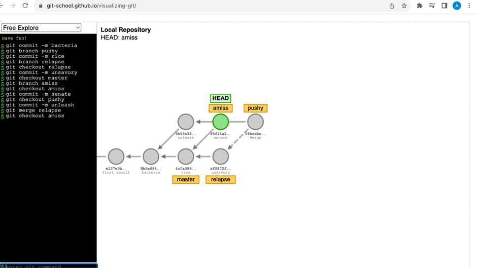

## Решение вариант 10 
 1. 

 2.

```bash 
git commit -m bacteria
git branch pushy
git commit -m rice
git branch relapse
git checkout relapse
git commit -m unsavory
git checkout master
git branch amiss
git checkout amiss
git commit -m senate
git checkout pushy
git commit -m unleash
git merge relapse
git checkout amiss
```