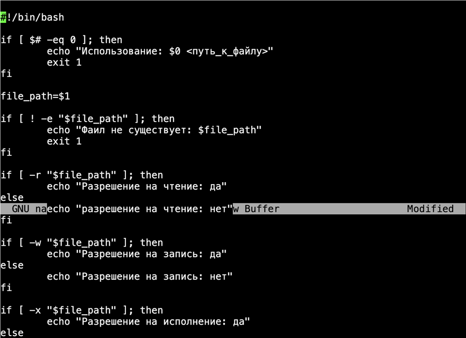
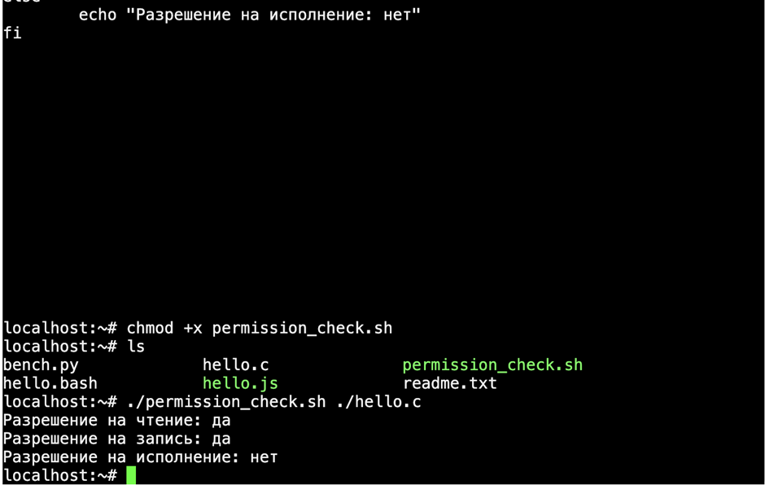

## Решение вариант 6
1.



2. 
```bash
git commit -m tipoff
git commit -m egomaniac
git commit -m ample
git checkout -b drearily
git commit -m tarot
git checkout master
git commit -m delusion
git checkout -b guidable
git merge drearily
git checkout -b definite
git commit -m tabloid
```
   