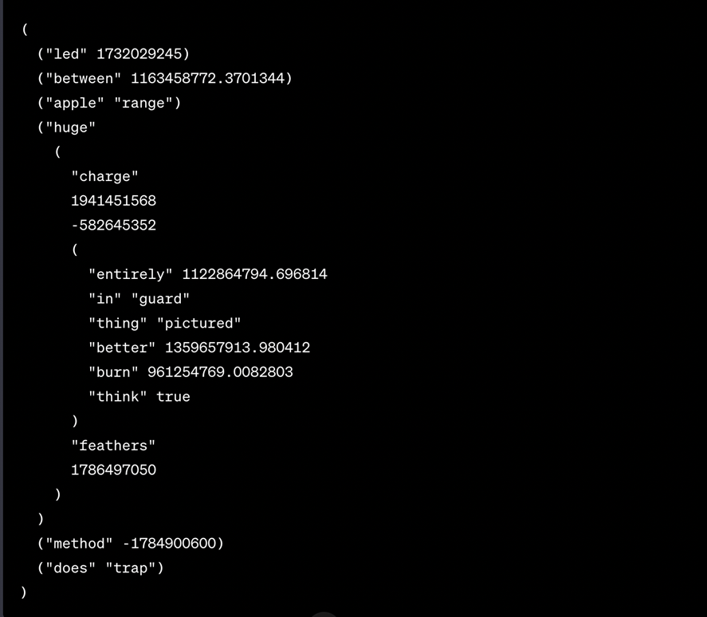

## Решение вариант 8 
 1. 
 
```bash
(led 1732029245)
(between 1163458772.3701344)
(apple "range")
(huge
    "charge"
    1941451568
    -582645352
    (entirely 1122864794.696814)
    (in guard)
    (thing pictured)
    (better 1359657913.980412)
    (burn 961254769.0082803)
    (think t)
    "feathers"
    1786497050)
(method -1784900600)
(does trap)
``` 
 2.
```bash
git commit -m clubhouse
git branch reversion
git checkout -b agreeing
git commit -m overreach
git commit -m barber
git checkout master
git commit -m unengaged
git commit -m preaching
git checkout -b laurel
git merge agreeing
git checkout master
git merge laurel
git checkout agreeing
git commit -m shimmy
```