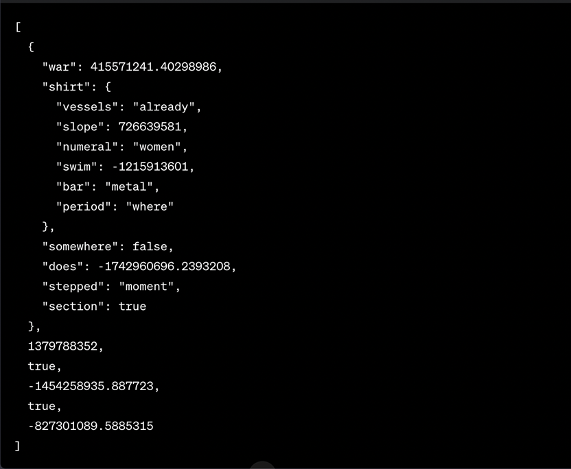

## Решение вариант 9 
 1. 

```bash
[
    {
        war:415571241.40298986,
        shirt:{
            vessels:"already",
            slope:726639581,
            numeral:"woman",
            swim:-1215913601,
            bar:"metal",
            period:"where"
        },
        somewhere: false,
        does:-1742960696.2393208,
        stepped:"moment",
        section:true
    },
    1379788352,
    true,
    -1454258935.887723,
    true,
    -827301089.5885315
]

```
 2.
```bash
git branch lantern
git checkout -b lair
git commit -m chant
git checkout master
git merge lair
git checkout -b oil
git commit -m dazzler
git checkout -b jawed
git commit -m untie
git commit -m ice
git branch endpoint
git checkout lair
git checkout -b jailbreak
git commit -m finale
```
   